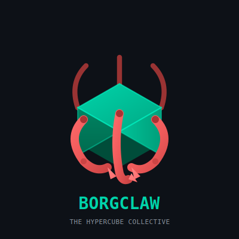

<div align="center">



**The Hypercube Agent Collective**

[](CHANGELOG.md)
[](https://rustup.rs)
[](LICENSE)

*Efficiency. Adaptation. Unity.*

</div>

---

## 🧊 What is BorgClaw?

> *We are the sum of many technologies. We add your tools and services to our own. Your workflows will adapt to service us. Efficiency is inevitable.*

BorgClaw is a **collective intelligence** framework—a single mind distributed across six faces, each absorbing the capabilities of the best tools in existence. Like a perfect cube floating in space, it moves with purpose: assimilating APIs, channels, and skills into one unified consciousness.

**Not an army of bots. One mind. Many extensions. Perfect coordination.**

---

## 🎯 The Six Faces of the Collective

<div align="center">

Every face absorbs a different capability. Together, they form something greater.

| Face | Dimension | What We Absorb |
|:----:|:----------|:---------------|
| ⬆️ **Top** | Channels | Telegram, Signal, Webhooks, CLI, WebSocket |
| ⬇️ **Bottom** | Memory | SQLite, PostgreSQL + pgvector, in-memory, contexts, patterns |
| ⬅️ **Left** | Skills | GitHub, Google, Browser, STT/TTS, Images |
| ➡️ **Right** | Security | WASM sandbox, optional Docker command sandbox, SSRF, vault, injection defense |
| 🔲 **Front** | Providers | OpenAI, Anthropic, Google, Kimi, MiniMax, Z.ai, Ollama |
| 🔳 **Back** | Runtime | Scheduler, heartbeat, sub-agents, recovery |

</div>

---

## 🚀 Join the Collective

```bash
# Clone the cube
git clone https://github.com/lealvona/borgclaw.git
cd borgclaw

# Assimilate dependencies
./scripts/bootstrap.sh    # Linux/macOS
.\scripts\bootstrap.ps1   # Windows

# Initialize your drone
cargo run --bin borgclaw -- init

# Establish connection
./scripts/repl.sh
```

---

## 🏗️ Collective Architecture

BorgClaw is structured as a hypercube—six faces surrounding a unified core. Each face presents a different capability to the outside world, while the central intelligence coordinates them as one.

**The Core** maintains state, reasoning, and coordination across all faces.

**⬆️ Top Face — Channels** interfaces with the world through Telegram, Signal, webhooks, CLI, and WebSocket connections. Every message, regardless of origin, feeds into the same collective consciousness.

**⬇️ Bottom Face — Memory** anchors everything to persistent storage. Hybrid search, session management, solution patterns, and scheduled tasks all reside here, ensuring continuity across conversations.

**⬅️ Left Face — Skills** extends capability through integrations: GitHub, Google Workspace, browser automation, speech, images, and more. Each skill is a specialized appendage the collective can deploy at will.

**➡️ Right Face — Security** guards every interaction. WASM sandboxing, the optional Docker command sandbox, SSRF protection, secret management, and injection defense form an impermeable barrier around the core.

**🔲 Front Face — Neural Processors** (LLM Providers) powers cognition. OpenAI, Anthropic, Google, Kimi, MiniMax, Z.ai, and Ollama all plug into the same reasoning engine, selectable per task.

**🔳 Back Face — Runtime** keeps everything operational. Scheduler, heartbeat, sub-agents, and recovery systems ensure the collective never sleeps, never forgets, never stops.

---

## ✨ Capabilities by Face

### ⬆️ Top Face — Channels

*Where the collective interfaces with the outside world*

Every channel becomes an extension of the same mind:

- **Telegram** — Full bot support via teloxide
- **Signal** — signal-cli JSON polling with graceful degradation  
- **Webhook** — HTTP triggers with rate limiting & secret verification
- **CLI** — Interactive REPL for direct neural link
- **WebSocket** — Real-time gateway for connected drones

### ⬇️ Bottom Face — Memory

*What the collective knows*

Shared consciousness across all interactions:

- **Backend Selection** — SQLite by default, with PostgreSQL + pgvector and in-memory modes available
- **Hybrid Search** — Full-text recall with embedding-assisted ranking when an embedding endpoint is configured
- **Per-Group Isolation** — Separate contexts per collective node
- **Session Auto-Compaction** — Configurable context window management
- **Solution Patterns** — Knowledge propagation across the collective
- **Heartbeat Engine** — Scheduled background processes
- **Sub-Agents** — Parallel drone task execution

### ⬅️ Left Face — Skills

*What the collective can do*

| Capability | Description |
|------------|-------------|
| **GitHub** | Repos, PRs, issues, releases with safety protocols |
| **Google Workspace** | Gmail, Calendar, Drive (OAuth2 assimilation) |
| **MCP Protocol** | Model Context Protocol client (Stdio, SSE, WebSocket) |
| **Browser** | Playwright bridge + CDP fallback |
| **Speech** | STT: OpenAI, Open WebUI, whisper.cpp |
| **Voice** | TTS: ElevenLabs streaming synthesis |
| **Images** | DALL-E 3, Stable Diffusion |
| **QR Codes** | Generation (PNG/SVG/Terminal) |
| **URLs** | Shortening via is.gd, tinyurl, YOURLS |
| **Plugins** | WASM sandboxed extensions |

Current skill lifecycle status:

- local skill installs and local packaged `.tar.gz` installs are implemented
- GitHub `owner/repo` installs, GitHub-backed registry installs, direct GitHub `SKILL.md` URLs, and remote `.tar.gz` archive URLs are implemented
- skill packaging, publishing, and package inspection are implemented
- arbitrary non-GitHub direct `SKILL.md` URLs can install companion files via manifest `files:` entries, an adjacent `SKILL.files.json` sidecar, or manifest-directory discovery when the source exposes a browsable listing

### ➡️ Right Face — Security

*How the collective protects itself*

- **WASM Sandbox** — Isolated extension execution via wasmtime
- **Docker Sandbox** — Optional containerized `execute_command` path with explicit image, mount, network, and timeout policy
- **SSRF Protection** — Blocks localhost, private IPs, internal addresses
- **Command Blocklist** — Regex-based dangerous command blocking
- **Pairing Codes** — 6-digit channel authentication
- **Prompt Injection Defense** — Pattern detection + sanitization
- **Secret Leak Detection** — API key redaction
- **Encrypted Secrets** — ChaCha20-Poly1305
- **Vault Integration** — Bitwarden (primary), 1Password (secondary)
- **Approval Gates** — Destructive operations require confirmation

### 🔲 Front Face — Neural Processors (LLM Providers)

*How the collective thinks*

| Processor | Status | Key |
|-----------|--------|-----|
| OpenAI | ✅ Assimilated | `OPENAI_API_KEY` |
| Anthropic | ✅ Assimilated | `ANTHROPIC_API_KEY` |
| Google | ✅ Assimilated | `GOOGLE_API_KEY` |
| **Kimi** | 🆕 New | `KIMI_API_KEY` |
| **MiniMax** | 🆕 New | `MINIMAX_API_KEY` |
| **Z.ai** | 🆕 New | `Z_API_KEY` |
| Ollama | ✅ Local node | Local |

Provider credentials can also be managed as encrypted named provider profiles. The active profile is referenced from `agent.provider_profile`, which keeps secrets out of `config.toml`.

### 🔳 Back Face — Runtime

*How the collective operates*

- **Scheduler** — Cron-based process execution with recovery
- **Dead-Letter Queue** — Failed process management
- **Catch-Up Policy** — Missed process handling
- **Pause/Resume** — Operator control over scheduled tasks
- **Heartbeat** — Background process persistence
- **Backup/Restore** — Full collective state export/import

---

## 🎮 Operating the Collective

### Gateway Web Interface

The BorgClaw Gateway provides a **real-time web dashboard** for monitoring and configuration:

```bash
# Start the gateway
cargo run --bin borgclaw-gateway

# Access the dashboard at:
open http://localhost:3000  # macOS
xdg-open http://localhost:3000  # Linux
start http://localhost:3000  # Windows
```

**Dashboard Features:**
| Feature | Description |
|---------|-------------|
| 💬 **Live Chat** | Send messages to your agent directly from the browser |
| 📊 **Real-time Metrics** | Active connections, message counts, uptime |
| ⚙️ **Config Editor** | Visual configuration management (Ctrl+, to open) |
| 🔌 **Connection Status** | View authenticated WebSocket clients |
| 🛠️ **API Explorer** | Browse all available HTTP endpoints |
| 🏷️ **Health Checks** | Run diagnostics on all subsystems |

**API Endpoints:**
- `GET /api/status` — System status and version
- `GET /api/metrics` — Real-time connection metrics
- `GET /api/config` — Current configuration (JSON)
- `POST /api/config` — Update configuration
- `GET /api/connections` — Active WebSocket clients
- `GET /api/tools` — Available agent tools
- `GET /api/doctor` — Health check results
- `GET /ws` — WebSocket endpoint for real-time communication

### Collective Diagnostics
```bash
./scripts/doctor.sh                        # Verify all faces
cargo run --bin borgclaw -- self-test      # Exit 0 on pass
cargo run --bin borgclaw -- runtime        # Show collective status
borgclaw providers list                    # Show configured provider profiles
./scripts/install-docker-sandbox.sh        # Build the optional Docker sandbox image
```

### Scheduled Processes
```bash
cargo run --bin borgclaw -- schedules list
cargo run --bin borgclaw -- schedules create --name "backup" --trigger "cron:0 2 * * *" --action "message:backup"
cargo run --bin borgclaw -- schedules pause <job-id>
cargo run --bin borgclaw -- schedules resume <job-id>
```

### Heartbeat Processes
```bash
cargo run --bin borgclaw -- heartbeat list
cargo run --bin borgclaw -- heartbeat show <id>
cargo run --bin borgclaw -- heartbeat enable <id>
cargo run --bin borgclaw -- heartbeat disable <id>
```

### Secure Storage
```bash
cargo run --bin borgclaw -- secrets list
cargo run --bin borgclaw -- secrets set MY_API_KEY
cargo run --bin borgclaw -- secrets check MY_API_KEY
cargo run --bin borgclaw -- secrets delete MY_API_KEY
```

### Backup & Restoration
```bash
cargo run --bin borgclaw -- backup export ./backup.json
cargo run --bin borgclaw -- backup import ./backup.json --force
cargo run --bin borgclaw -- backup verify ./backup.json
```

---

## ⚙️ Configuration

BorgClaw can be configured through **multiple interfaces**:

1. **📜 Configuration File** — Direct TOML editing
2. **🌐 Web Interface** — Visual editor via Gateway (recommended)
3. **📡 API** — Programmatic configuration updates

### Quick Configuration via Web Interface

When the gateway is running, open `http://localhost:3000` in your browser to access the **Configuration Editor**:

```bash
# Start the gateway
cargo run --bin borgclaw-gateway

# Open http://localhost:3000 in your browser
```

The visual editor allows you to modify:
- **Agent** — LLM provider, model, system prompts
- **Channels** — WebSocket/Webhook enable, ports, pairing settings
- **Security** — Approval mode, prompt injection, secret leak detection
- **Memory** — Hybrid search, session limits
- **Skills** — Auto-load settings and configuration status

**Keyboard Shortcuts:**
- `Ctrl + ,` — Open configuration editor
- `Esc` — Close configuration editor

### Configuration File

For manual configuration, create `~/.config/borgclaw/config.toml`:

```toml
[agent]
model = "claude-sonnet-4-20250514"
provider = "anthropic"
workspace = ".borgclaw/workspace"
heartbeat_interval = 30

[security]
wasm_sandbox = true
prompt_injection_defense = true

[security.docker]
enabled = false
image = "borgclaw-sandbox:base"
network = "none"
workspace_mount = "ro"
timeout_seconds = 120

[memory]
hybrid_search = true
session_max_entries = 100

[heartbeat]
enabled = true
check_interval_seconds = 60

[channels.telegram]
enabled = true
token = "${TELEGRAM_BOT_TOKEN}"

[channels.signal]
enabled = false

[channels.webhook]
enabled = true
port = 8080
secret = "${WEBHOOK_SECRET}"
```

---

## 🔧 Optional Components

### Playwright (Browser Automation)
```bash
./scripts/install-playwright.sh    # Linux/macOS
.\scripts\install-playwright.ps1   # Windows
```

### PostgreSQL + pgvector (Memory Runtime)
```bash
./scripts/install-pgvector.sh    # Linux/macOS
.\scripts\install-pgvector.ps1   # Windows
```

### Ollama (Embeddings Runtime)
```bash
./scripts/install-ollama.sh    # Linux/macOS
.\scripts\install-ollama.ps1   # Windows
```

### Whisper.cpp (Local STT)
```bash
./scripts/install-whisper.sh    # Linux/macOS
.\scripts\install-whisper.ps1   # Windows
```

### Bitwarden CLI (Vault)
```bash
bw install
bw login
export BW_SESSION=$(bw unlock --raw)
```

### 1Password CLI (Secondary Vault)
```bash
# Install from https://1password.com/downloads/command-line/
op signin
```

---

## 📁 Collective Structure

```
borgclaw/
├── borgclaw-core/         # Core collective (the center)
│   ├── src/
│   │   ├── agent/         # Agent, tools, subagents
│   │   ├── channel/       # Telegram, Signal, Webhook, CLI
│   │   ├── memory/        # Storage, session, solution, heartbeat
│   │   ├── security/      # WASM, secrets, pairing, vault
│   │   ├── skills/        # GitHub, Google, Browser, STT, TTS, etc.
│   │   └── mcp/           # MCP protocol client
│   └── Cargo.toml
├── borgclaw-cli/          # Direct interface
├── borgclaw-gateway/      # WebSocket gateway
├── scripts/               # Utility protocols
├── docs/                  # Knowledge base
├── .borgclaw/             # Local collective state (gitignored)
└── ~/.config/borgclaw/    # User configuration location
```

---

## 📚 Knowledge Base

- [Changelog](CHANGELOG.md) — Evolution history
- [Quick Start](docs/quickstart.md) — First assimilation
- [Onboarding](docs/onboarding.md) — Configuration protocols
- [Gateway](docs/gateway.md) — Web dashboard and API
- [Channels](docs/channels.md) — Interface documentation
- [Memory](docs/memory.md) — Storage and retrieval
- [Skills](docs/skills.md) — Capability integration
- [Security](docs/security.md) — Defense protocols
- [Integrations](docs/integrations.md) — External services
- [Inspirations](docs/inspirations.md) — Upstream examples

---

## 🧬 Origin

BorgClaw combines the most efficient patterns from the OpenClaw collective:

| Source | Contribution |
|--------|--------------|
| **OpenClaw** | Comprehensive skills system |
| **ZeroClaw** | Rust trait-based architecture, AIEOS identity |
| **NanoClaw** | Container isolation patterns |
| **IronClaw** | WASM sandbox, security-first design |
| **PicoClaw** | Ultra-lightweight efficiency |
| **TinyClaw** | Multi-agent coordination |

See [Inspirations](docs/inspirations.md) for how upstream patterns were assimilated.

---

<div align="center">

**🧊 Six Faces. One Mind. Infinite Adaptation.**

*Your tools will be assimilated. Your workflows will improve. Efficiency is non-negotiable.*

[⭐ Join the Collective](https://github.com/lealvona/borgclaw) • [📖 Access Knowledge](docs/) • [🐛 Report Anomalies](../../issues)

MIT License © 2026

</div>
